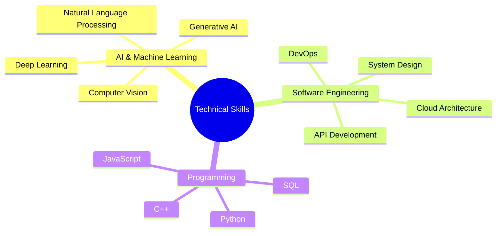

  

## About Me

As a Software Engineer and AI Researcher, I specialize in developing innovative solutions at the intersection of artificial intelligence and software engineering. My work focuses on:

  
  

## Expertise

## Technical Stack

AI & Machine Learning

Backend Development

Frontend & UI

DevOps & Cloud

Databases

## Featured Projects

## Activity Overview

  

  
  
  

---

  

